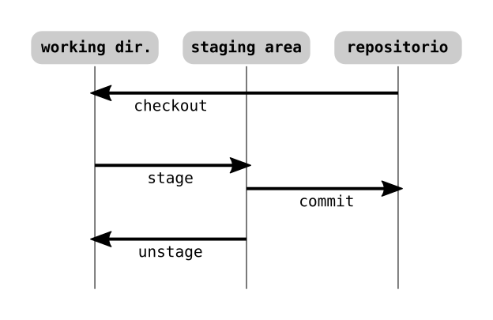

# Primeros pasos en *Git*

Lógicamente, debe estar instalado un cliente *Git* en el host local.

Existen varios tipos de aplicaciones *VCS* (*version control system*). Un *VCS* local es útil solamente para un único desarrollador, que va almacenando sus versiones en un repositorio local.

Los *CVCS* (centralizados) consisten en un repositorio en un servidor, al que acceden y en el que trabajan varios desarrolladores al mismo tiempo. Si cae el servidor, los desarrolladores no pueden trabajar sobre el repositorio.

En los *DVCS* (distribuidos, como *Git*), cada desarrollador tiene una copia entera del repositorio en su equipo, incluyendo todas las versiones existentes. Así, todos pueden trabajar *offline*, haciendo los *commits* que quieran. Solo deberán hacer *push* de esos *commits* cuando estén conectados (si necesitan hacerlo). Si se pierde el repositorio del servidor, cualquier copia local es un *backup* completo.

## Visión general

En cada *commit* (versión), *Git* crea una instantánea completa del proyecto. El *commit* es una referencia (*hash SHA-1*) a esa instantánea. Un archivo que no ha cambiado en esa versión no se vuelve a crear, sino que se almacena un enlace a la versión anterior del mismo. La diferencia con otros *VCS* es que estos suelen almacenar deltas (*diff*), es decir, únicamente los cambios producidos en la versión.

*Git* comprueba la integridad de los datos: dado que cada versión *committed* (cada *snapshot*) tiene un identificador *hash* (*SHA-1*), es imposible manipular un archivo del repositorio sin que sea detectado.

Casi todas las acciones en *Git* **añaden** datos, con lo que prácticamente todo se puede deshacer.

Los archivos pueden tener distintos estados, y residirán en una u otra ubicación según dicho estado.

Dentro de la carpeta del proyecto, existe una subcarpeta ***.git*** donde reside el repositorio completo, con todas sus versiones. Fuera de dicha subcarpeta, tenemos el directorio de trabajo (*working dir*) que no es más que una de las versiones (normalmente la última) del proyecto; es la versión sobre la que estamos trabajando.

\
*Ubicaciones en un repositorio Git.*

Dentro del directorio de trabajo existen archivos no modificados (*unmodified*), es decir, que coinciden con la versión existente en el repositorio.

Un *checkout* consiste en llenar el directorio de trabajo con una de las versiones existentes en el repositorio. Al hacerlo, todos los archivos están sin modificar.

Si editamos uno de los archivos del directorio de trabajo, el archivo pasa a *modified*. Si queremos que en el próximo *commit* se incluyan esos cambios, hay que pasar el archivo a *staged*. El *commit* incluirá todos los cambios en la *staging area*, también llamada *index*, que es un archivo (dentro de ***.git***) que tiene información sobre todos estos cambios.

Se pueden quitar cambios del *index* (*unstage*), de tal modo que esos cambios pasarán de *staged* a *modified* nuevamente.

Una vez los cambios en la *staging area* han sido *committed*, los archivos involucrados en el directorio de trabajo pasan nuevamente a *unmodified*, ya que coinciden con la última versión en el repositorio.

Cuando se clona un repositorio remoto, se copia al equipo local el repositorio (subcarpeta ***.git***), y de este se extrae la última versión al directorio de trabajo (se hace un *checkout* al *working dir*).

Cada *commit* incluye únicamente lo que hay presente en la *staging area*.

En cuanto a los estados, estamos hablando de archivos rastreados por *Git* (*tracked*). Sin embargo, en el proyecto puede haber otros archivos que, por el motivo que sea, no lo están (*untracked*).

## Configuración

Para editar la configuración se puede hacer a través de comandos *Git* o editando los archivos de configuración correspondientes. El comando básico es `git config`. Existen tres niveles de configuración:
- Nivel de sistema: afecta a todos los usuarios del equipo. Se añade el *flag* `--system`. La configuración suele estar en el archivo ***/etc/gitconfig***.
- Nivel global: afecta a todos los proyectos del usuario. Se añade `--global`, y suele almacenarse en `~/.gitconfig`, o `~/.config/git`.
- Nivel local: solo afecta al repositorio actual. Es la opción por defecto, aunque se puede especificar `--local`. Se almacena la configuración en el archivo ***.git/config*** dentro del proyecto.

La configuración de un nivel específico *overrides* la de un nivel más general.

Ejemplos:

```
git config user.name "Pepe Pótamo"
git config user.email pepe@potamo.com
git config core.editor vim
```

Cuando el valor contiene espacios se deben usar comillas dobles.

Todo repositorio debe estar en una **rama** (se explicará más adelante). Por defecto, al inicializar un repositorio, se crea una rama ***master*** para este, por defecto. Para cambiar el nombre por defecto:

```
git config --global init.defaultBranch principal
```

Para ver la configuración actual:

```
git config --list
```

En el listado es posible que una variable aparezca varias veces, si está definida en varios niveles. En este caso, la última aparición es la que cuenta.

Para ver el valor de una variable de configuración concreta:

```
git config user.name
```

Para ver qué nivel es el que da el valor efectivo a esa variable:

```
git config --show-origin user.name
```

## Ayuda

Para conseguir ayuda sobre un comando concreto, existen varias formas:

```
git help <comando>
git <comando> --help
man git-<comando>
```

Para una explicación resumida:

```
git <comando> -h
```
