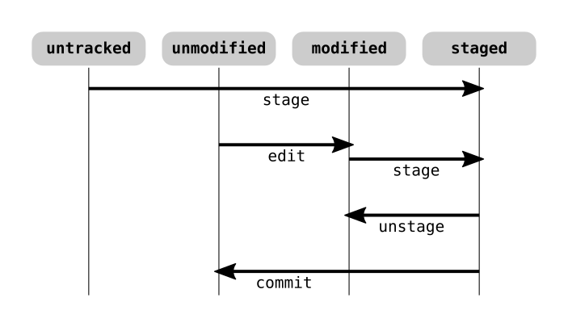

# Bases de *Git*

Para inicializar un repositorio local, desde el directorio raíz del proyecto se teclea:

```
git init
```

Esto creará una subcarpeta ***.git*** con el repositorio (sin *commits* todavía). Inicialmente, todos los archivos del directorio de trabajo están *untracked*. Estaremos en la rama por defecto (suele llamarse ***master***), y nos faltaría configurar el servidor al que subir (*push*) y del que descargar (*fetch*) cambios. Si queremos hacer *push*, también habrá que configurar las credenciales de autenticación.

Si lo que hacemos, en cambio, es clonar un repositorio de un servidor:

```
git clone <URL>
```

Esto creará una carpeta con el nombre de la última parte de la *URL*, en la que se incluirá una copia completa del repositorio (en subcarpeta ***.git***) y un *checkout* del último *commit* de la rama principal como directorio de trabajo.

En este caso, los archivos están *tracked*, el nombre de la rama será el de la última versión en el repositorio, y ya está configurado el servidor. Solo faltaría configurar los datos de autenticación (si queremos enviar cambios).

Si queremos especificar el nombre de la carpeta en nuestro equipo local:

```
git clone <URL> <nombreDir>
```

Los comandos *Git* pueden teclearse desde cualquier carpeta del proyecto.

En cuanto a la autenticación, *Git* admite varios protocolos, que se verán más adelante.

## Estados

Los archivos pueden estar *untracked* (no rastreados) o *tracked* (rastreados). En este último caso, pueden estar *unmodified* (no modificados), *modified* (modificados), o *staged* (listos para *commit*).

\
*Estados de los archivos en un repositorio Git.*

Para comprobar el estado de un repositorio disponemos del comando:

```
git status
```

Nos dará información de los archivos y su estado.

Para pasar archivos al área de *stage* (ya sean archivos *untracked* y/o *modified*), se usa el comando:

```
git add <archivo(s)>
```

En ***\<archivo(s)>*** indicamos los archivos deseados. Admite *wildcards* (***\****, ***?***), y podemos especificar varios nombres separados por espacio.

Si uno de los nombres es una carpeta, se añaden todos los archivos que contiene (y los de sus subcarpetas).

Si como archivo indicamos ***.*** o ***\****, se incluirá **todo** lo *modified* (y/o *untracked*) en el proyecto (si tecleamos el comando desde el raíz del mismo).

Para quitar un archivo de la zona de *stage*, es decir, para que los cambios dejen de estar listos para el *commit*:

```
git restore --staged <archivo(s)>
```

Esto retornará los archivos indicados a su anterior estado (*modified* o *untracked*).

Si lo que deseamos es restaurar un archivo a la versión del repositorio, siempre y cuando el archivo no esté *staged*, y exista una versión anterior en el repositorio:

```
git restore <archivo(s)>
```

Pongamos por ejemplo que un archivo *unmodified* es editado. Entonces pasa a *modified*. Luego lo añadimos al *staging area*, con lo que aparecerá como preparado para *commit*, es decir, *staged*. Si ahora volvemos a editarlo, aparecerá como *staged* y como *modified*. Ello se debe a que parte de sus cambios están listos para el *commit*, pero los últimos que hemos hecho no se incluirán en dicho *commit* hasta que los pasemos al área de *staging* añadiendo el archivo con `git add` nuevamente.

Es posible obtener el **estado abreviado** mediante el comando:

```
git status --short
git status -s
```

En este caso solo aparecerá el nombre de los archivos relevantes, precedidos por un código de dos caracteres, formando dos columnas de caracteres. Uno de los caracteres puede ser un espacio.

El primer carácter indica el estado **en la** ***staging area***, y el segundo, en el directorio de trabajo.

Un archivo *untracked* mostrará `??`. Por otro lado, el carácter que indica que un archivo ha sido añadido (mediante `git add`) desde el estado *untracked* es `A`. El carácter que indica modificación es `M`.

Veamos un ejemplo: un archivo *untracked* (`??`) que se añade al repositorio pasará a mostrar `A` en la primera columna. Si posteriormente (y antes del *commit*) modificamos ese archivo en el directorio de trabajo, mostrará `AM`. Si pasamos estos nuevos cambios al área de *staging*, volverá a mostrar `A` en la primera columna.

Otro ejemplo: un archivo modificado tras el último *commit* mostrará `M` en la segunda columna. Si lo añadimos con `git add`, pasará a mostrar `M` en la primera columna. Si tras esto (y antes de un *commit*) lo volvemos a modificar, mostrará `MM`. Si lo volvemos a añadir, volverá a mostrar `M` en la primera columna.

Tras un *commit*, `git status -s` no muestra nada.

## Ignorar archivos

A veces nos interesará tener archivos en el directorio de trabajo que no estén rastreados por *Git*. Entonces incluiremos el archivo ***.gitignore*** para que sean ignorados.

En cada carpeta del proyecto podemos tener un ***.gitignore*** que especifique una lista con los elementos que deben ser ignorados. En cada línea de la lista se incluye un nombre o patrón. Se admiten *wildcards* (***\****, ***?***), y conjuntos de caracteres del tipo ***[apqw]*** o ***[0-9]***. La secuencia ***\*\****, indica número arbitrario de carpetas anidadas (por ejemplo, `a/**/z` coincide con ***a/z***, ***a/b/z***, o ***a/b/c/d/z***).

Los patrones referidos a elementos (archivos y directorios) del mismo nivel que el archivo ***.gitignore***, es decir, los **patrones sin ruta** como prefijo (solo el nombre del elemento), se aplicarán **recursivamente** a todas las subcarpetas del directorio actual. En cambio, **si se prefija una ruta no se aplicará recursividad**. Las rutas siempre son relativas al directorio actual, es decir, la carpeta donde está el archivo ***.gitignore***:

```
# Ignora todos los archivos PDF, recursivamente desde la carpeta actual:
*.pdf

# Ignora solo archivos PDF de la carpeta ./doc:
doc/*.pdf

# Ignora solo los archivos PDF de la carpeta actual:
/*.pdf
```

Como podemos ver en el último ejemplo, para evitar la recursión se prefija la ruta mínima ***/*** referida al directorio actual.

Los patrones se aplican **tanto a archivos como a carpetas**. Por lo tanto, en los ejemplos anteriores, una carpeta con extensión ***.pdf*** también se ignoraría, como si fuese un archivo *PDF*.

Puede haber un archivo ***.gitignore*** en cada carpeta del proyecto.

Las líneas en blanco y las que empiezan por almohadilla (***#***) se descartan.

Para que el patrón se aplique **solo a directorios**, debe terminar en ***/***.

Para **negar el patrón**, deberá empezar por ***!***. Esto es útil tras un patrón anterior más general en el mismo archivo, o en un archivo ***.gitignore*** en un nivel inferior en la jerarquía de carpetas.

> No es posible añadir al repositorio un directorio vacío, o compuesto únicamente por archivos ignorados.

Ejemplos:

```
*.a
!lib.a
```

Ignora (recursivamente) todos los elementos con extensión ***.a***, excepto ***lib.a***.

```
doc/*.pdf
```

Ignora todos los elementos ***.pdf***, de la carpeta ***doc*** (pero no los de subcarpetas de esta).

```
doc/**/*.pdf
```

Ignora todos los elementos ***.pdf***, de la carpeta ***doc*** **y de sus subcarpetas**.

Por otro lado, puede resultar útil ver qué archivos están siendo ignorados:

```
git status --ignored
```

## Diferencias

A parte de ver el estado de los archivos, podemos ver las diferencias concretas:

```
git diff
```

Este comando nos muestra los cambios que no han sido enviados al área de *stage* todavía.

```
git diff --staged
```

En este caso, se muestran los cambios listos para el *commit*.

## *Commit*

Para hacer *commits* es necesario, como mínimo, tener configurado el nombre y correo electrónico del usuario.

Al hacer *commit*, los cambios *staged* son utilizados para crear una nueva instantánea del repositorio.

Si tecleamos:

```
git commit
```

Se abrirá el editor de texto por defecto. En él veremos un archivo que incluye líneas de comentario (encabezadas por almohadilla), que nos darán información sobre el *commit* que vamos a realizar (concretamente la información de `git status`). El motivo de dicho archivo es incluir una descripción para el *commit* que vamos a realizar. Si no guardamos el archivo o no incluimos ninguna descripción (en una línea que no sea de comentario), se cancela el *commit*. Si queremos ver más información (relación de cambios) en ese archivo comentado, podemos teclear:

```
git commit -v
```

Si queremos indicar la descripción directamente, sin pasar por el editor de texto:

```
git commit -m "Comentario descriptivo de este commit"
```

Obsérvense las comillas dobles, dado que el comentario incluye espacios.

Existe un modo de hace *commit* sin tener que pasar archivos a *staged*:

```
git commit -a -m "Comentario del commit"
```
Equivale a añadir **todos** los archivos *modified* del proyecto.

## Eliminación de archivos

Si eliminamos simplemente un archivo desde una aplicación externa a *Git* (como `rm` de *Unix*), será visto como un cambio *unstaged*, por lo que en el siguiente *commit* no aparecerá tal cambio. Así, podríamos borrar el archivo:

```
rm file1.txt
```

Luego pasar el cambio a *staged*:

```
git add file1.txt
```

Sin embargo, en lugar de teclear estos dos comandos, podemos usar simplemente un comando que equivale e los dos anteriores:

```
git rm file1.txt
```

Esto elimina el archivo del directorio de trabajo y marca el cambio como *staged*. En el siguiente *commit*, el archivo ya no estará en la nueva versión. El comando `git rm` acepta el flag `-r` para borrar directorios recursivamente.

Para restaurar archivos borrados, se procede de forma similar al mecanismo para *unstage*:

```
git restore --staged file1.txt
```

Elimina el cambio del *index*.

```
git restore file1.txt
```

Restaura el archivo desde el repositorio (si existe una versión allí).

Existe un modo de eliminar archivos del repositorio sin eliminarlos del directorio de trabajo, es decir, pasarlos a *untracked*:

```
git rm --cached <archivo(s)>
```

> En todo caso, hay que tener en cuenta que eliminar (y crear) directorios o estructuras de directorios vacíos (sin archivos), no tiene ningún efecto en el siguiente *commit*.

## Renombrar archivos

Supongamos que un archivo ***org.txt*** se tiene que renombrar a ***dest.txt***. En realidad es como borrar un archivo y crear otro con distinto nombre:

```
mv org.txt dest.txt
git rm org.txt
git add dest.txt
```

Estos tres comandos equivalen a este:

```
git mv org.txt dest.txt
```

En cualquiera de los dos casos, *Git* se da cuenta de que ha sido un cambio de nombre (y/o cambio de ubicación). En todo caso, tras el *commit*, el cambio queda en el repositorio.

Dependiendo del sistema operativo, es posible que *git* esté configurado como *case insensitive* (opción de configuración `core.ignorecase`), con lo que cambiar simplemente los caracteres de un nombre de archivo o directorio a sus correspondientes mayúsculas o minúsculas, puede que no se interprete como un cambio, y no aparezca en el siguiente *commit*. en todo caso, para forzar un renombrado *case sensitive*, se puede usar el *flag* `-f`:

```
git mv -f folder1 Folder1
```

En todo caso, renombrar un directorio o estructura de directorios vacío, al igual que sucedía con la eliminación, no tiene efecto alguno en el *commit*.

## Histórico de *commits*

Para ver el histórico de versiones:

```
git log
```

Esto muestra los *commits* en orden cronológico inverso. Con el flag `-p` o `--patch` muestra los cambios en cada *commit*. También se puede limitar el número máximo de *commits* mostrados (`-1`, `-2`,...). Con `--stat` se incluye un breve resumen bajo cada *commit*. Usando `--pretty` se muestra un formato distinto. `--no-merges` sirve para filtrar *commits* debido a un *merge*. Hay otras muchas opciones.

También se puede filtrar la lista según los *commits* que hayan afectado a uno o más archivos concretos, mediante:

```
git log -- <archivo(s)>
```

El doble guión es para separar las rutas de archivos (que van al final de todo) de otras opciones.

Una de las múltiples opciones es `--oneline`, que muestra un *commit* por línea.

## Deshacer errores

Supongamos que nos equivocamos en un *commit*.

Primero debemos realizar todos los cambios que deberíamos haber hecho. Luego los añadimos a la *stage area*. Supongamos que también queremos editar la descripción del *commit*:

```
git commit --amend
```

Esto nos abrirá el editor de texto, y podremos editar la descripción anterior. Si queremos reescribir completamente esa descripción podemos usar la opción `-m` en lugar de usar el editor. En todo caso, los cambios (si los hay) se añaden al último *commit*, y su descripción es reemplazada por la nueva. Esto no debe hacerse en *commits* que se hayan subido ya al servidor (puede crear problemas a los colaboradores).

## *Unstaging*, *unmodifying*

Ya hemos visto como tirar para atrás un *staging*:

```
git restore --staged <archivo(s)>
```

Y para revertir los cambios de un archivo *modified* al estado del repositorio (*unmodified*):

```
git restore <archivo(s)>
```

## Remotos

Los remotos son otras copias del repositorio externas a la actual. Los remotos pueden estar en un *host* distinto o en el *host* local. Podría darse el caso de tener varios remotos asociados a un proyecto.

El comando básico para gestionar remotos es `git remote`. Es necesario configurar los distintos remotos, a los que da un nombre corto (para no tener que referirnos a ellos por la *URL*). Si hemos clonado de un servidor, ya hay un remoto definido al que, por defecto, *Git* da el nombre ***origin***.

Si tecleamos `git remote`, nos mostrará los nombres cortos de los remotos. Si añadimos `-v`, además nos indicará la *URL* de cada uno (para los *push* y para los *fetch*).

Para añadir un remoto:

```
git remote add <nombreCorto> <URL>
```

Supongamos que hemos añadido un remoto con nombre corto ***pb***. Si tecleamos `git fetch`, descargamos las nuevas versiones del remoto por defecto (***origin***). Para descargar del que hemos añadido:

```
git fetch pb
```

Hay muchas formas de organizar el trabajo, dependiendo de cada proyecto, desarrolladores, organización de la empresa, etc. Una forma sería que cada departamento tuviese su propio repositorio central, de tal modo que solo trabajaran una rama del proyecto. Podría haber un coordinador general encargado de centralizar todos los cambios hacia un repositorio central maestro. ¿Cómo lo haría? En primer lugar, tendría definidos varios remotos en su repositorio local, correspondientes a los repositorios centrales de cada departamento. Cuando fuese necesario, podría fusionar una de las ramas de uno de esos remotos con la rama principal del proyecto. Podría hacerlo en su repositorio local, y subirlo (*push*) al servidor principal maestro. Luego, todos los departamentos podrían actualizarse a la versión que incorporara esos cambios.

Cuando hacemos *fetch* de un remoto, los *commits* recibidos no van directamente a la rama en la que estamos trabajando, sino que van a una rama (local) llamada ***<nombreRemoto>/<nombreRama>***. Aunque solo haya una rama en el proyecto (llamada, normalmente ***master***), al hacer un *fetch* del remoto por defecto (***origin***), los cambios descargados no van a parar a nuestra rama ***master*** local, sino a la rama local ***origin/master***. Si nos parece bien, fusionamos (*merge*) las dos ramas en local, de tal modo que ***origin/master*** desaparece, y ***master*** se actualiza.

Si el remoto ***db*** tiene varias ramas con cambios, lo recibiremos todo en ramas locales ***db/rama1***, ***db/rama2***, etc. Podemos revisarlas, fusionarlas, etc

Por otro lado, si queremos enviar cambios *upstream* (corriente arriba), habrá que hacerlo con un *push*. En este caso si hacemos `git push` enviará los *commits* de la rama actual (local) a fusionarse con la rama principal del remoto por defecto. Pero si queremos especificar dónde queremos que vaya a parar ese *push*:

```
git push <nombreRemoto> <nombreRama>
```

Si esa rama de ese remoto tiene cambios que no tenemos en local, el *push* es rechazado. Primero hay que hacer *fetch* de esos cambios y fusionarlos (*merge*) con los nuestros.

Para obtener información de uno de nuestros remotos:

```
git remote show <nombreRemoto>
```

Para cambiar el nombre corto de un remoto:

```
git remote rename <antiguo> <nuevo>
```

Eliminar un remoto:

```
git remote remove <nombreRemoto>
```

En lugar de `remove` se puede escribir `rm`.

## Tagging

Es un mecanismo para marcar algunos *commits* como importantes (puntos de *release*, por ejemplo).

Para ver los *tags* (muestra los nombres de las etiquetas en orden alfabético):

```
git tag
```

Para ver un subconjunto, se puede usar el flag `--list` (o `-l`) junto con los *wildcards* deseados.

```
git tag --list "1.5.*"
```

### Checkouts

Es posible establecer el estado del directorio de trabajo en un *commit* anterior. Para ello se debe hacer un *checkout* de esa versión:

```
git checkout <nombreTag>
git checkout <commitChecksum>
git checkout <nombreRama>
```

En la primera versión simplemente indicamos el nombre de la etiqueta para ir hasta ese *commit*. En el segundo caso, simplemente indicamos el *checksum* del *commit* deseado. No es necesario indicar los 40 caracteres del *hash SHA-1*. Con indicar algunos caracteres iniciales es suficiente.

Es importante recalcar que si el estado actual del directorio de trabajo no se corresponde con el **último *commit* de la rama actual** (aunque sea el último *commit* de otra rama), nos encontramos en un estado de ***HEAD* desacoplada**, o *detached HEAD* (***HEAD*** es el apuntador al estado actual). En este estado, cualquier *commit* que realicemos a partir de este punto no pertenecerá a ninguna rama, por lo que no será alcanzable desde ninguna rama (solo indicando el *checksum* del *commit* en sí). Sin embargo, sí se puede crear una rama nueva a partir de un punto con *detached HEAD*. Hablaremos sobre ramas más adelante.

### Tipos de etiquetas

*Annotated tags*: objetos completos almacenados en el repositorio. Como objeto, tienen su *checksum SHA-1*, nombre de su creador, su correo, fecha y descripción.

Creación de una *annotated tag* (apuntará al último *commit*):

```
git tag -a 2.0.0 -m "La versión 2"
```
Si no especificamos el mensaje, se abre el editor de texto, como en los *commits*.

Para ver la información de una etiqueta:

```
git show 2.0.1
```

*Lightweight tags*: son simplemente un apuntador a un *commit* específico. Para crearlas no hay que especificar ninguna información, ni `-a`:

```
git tag 2.0.1
```

Para etiquetar un *commit* que no es el último, obtener el *checksum* del mismo (con `git log`), e indicarlo (con algunos caracteres iniciales es suficiente) al final.

En cuanto al número definido, algunas herramientas como *Composer* lo utilizan para tirar de una versión específica. Estas herramientas aceptan el número tal cual, o con un ***v*** como prefijo. En este caso, ***2.1.3*** tendría el mismo efecto que ***v2.1.3***.

Por defecto, las etiquetas no son enviadas al remoto mediante *push*. Hay que subirlas explícitamente:

```
git push <nombreRemoto> <nombreEtiqueta>
```

Para subir **todas** nuestras etiquetas (ligeras y *annotated*) a un remoto (las que ya existan allí no se enviarán):

```
git push <nombreRemoto> --tags
```

Se puede obviar el nombre del remoto (las enviará al remoto por defecto).

Para eliminar una etiqueta (local):

```
git tag -d <nombreEtiqueta>
```

Si queremos eliminarla de un remoto:

```
git push <nombreRemoto> --delete <nombreEtiqueta>
```

> La numeración que suele utilizarse es del tipo major.minor.patch: *patch* se refiere a mejoras superficiales y *bugfixes*; *minor* son cambios que suelen ser *backward-compatible*; *major* son grandes cambios que no suelen ser *backward-compatible*.

## Alias

Pueden definirse alias para escribir comandos usando menos teclas. Por ejemplo:

```
git config alias.s status
git config alias.co 'commit -m "Minor cambios"'
```

En este caso, podremos escribir `git s` en lugar de `git status`, o `git co` en lugar de `git commit -m "Minor cambios"`.
